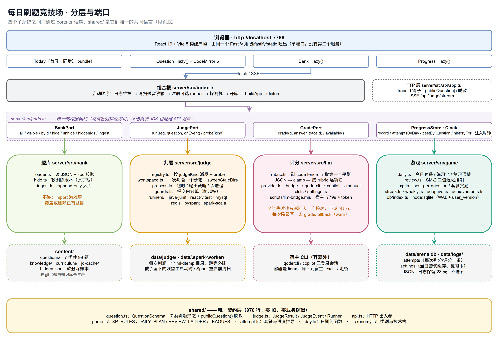
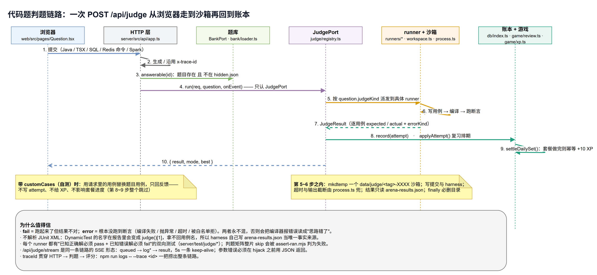
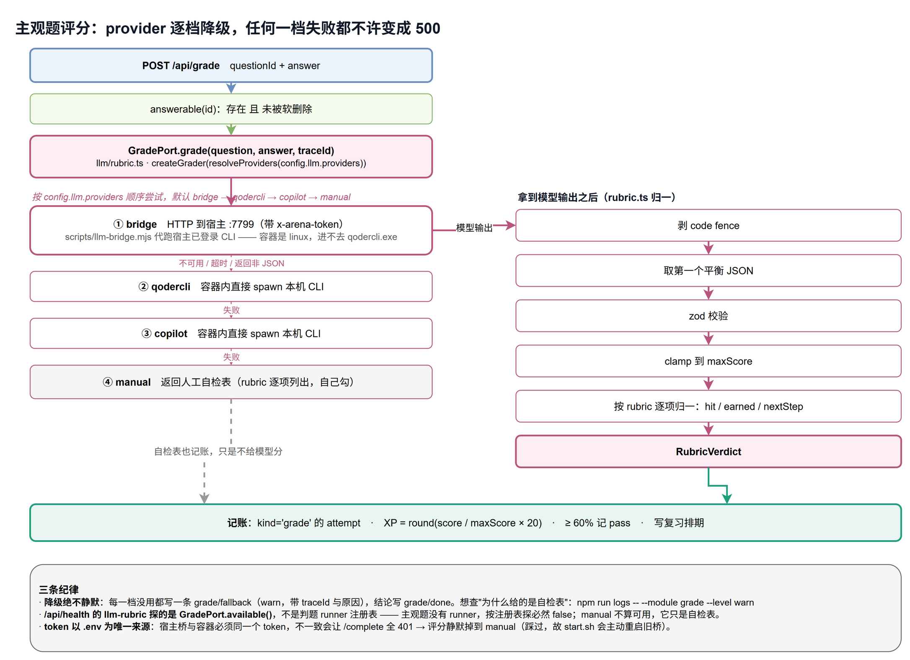
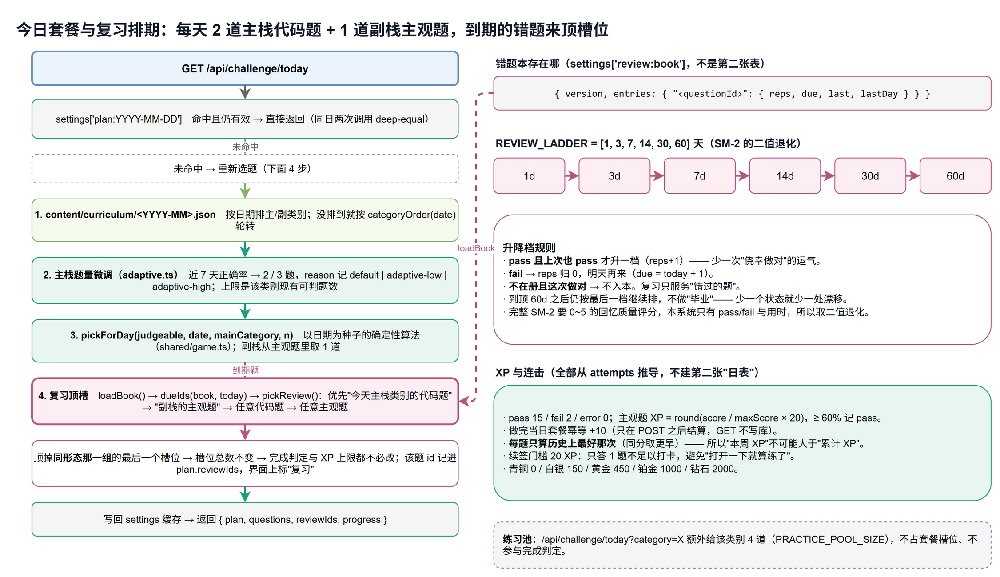
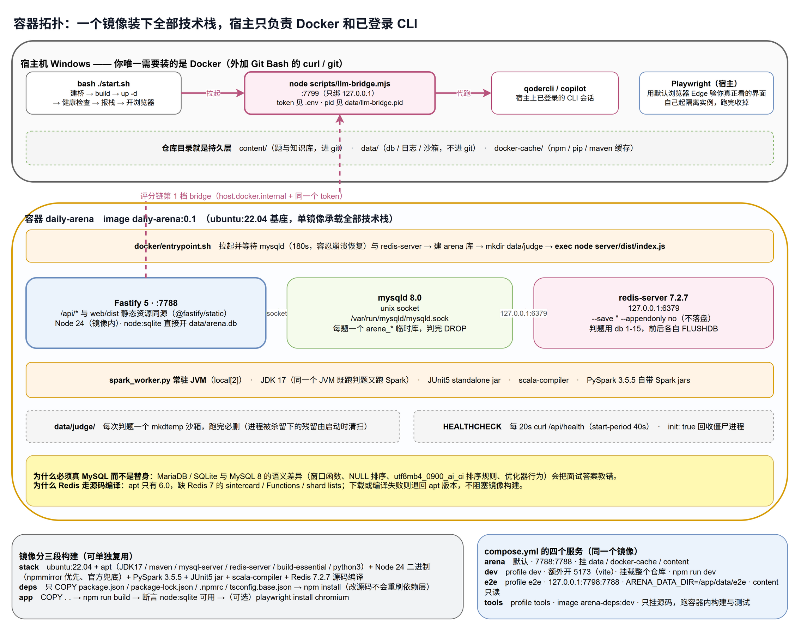
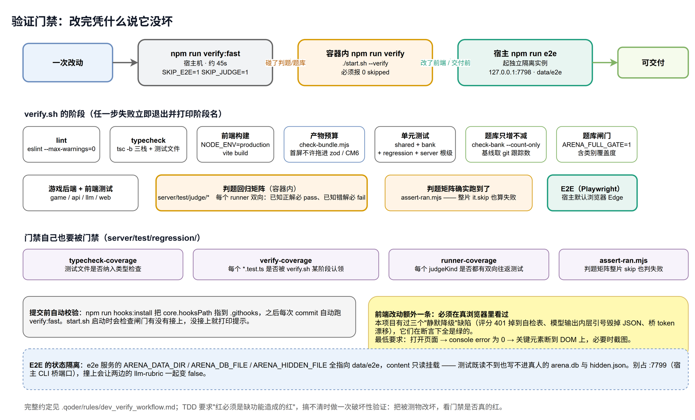

# 架构总览（当前实现）

> 这份文档回答四个问题：**前端是什么、后端是什么、判题怎么做、docker 怎么服务**，
> 外加**所有启动脚本怎么用**。设计取舍的"为什么"散落在各节；正式需求契约在 `openspec/specs/`，
> 判题器逐栈约定在 [`JUDGING.md`](./JUDGING.md)，加题流程在 [`ADD_QUESTIONS.md`](./ADD_QUESTIONS.md)。

**一句话**：`content/`（题库）→ `shared/`（契约）→ `server/`（判题 + 评分 + 游戏）→ `web/`（界面），
一个 Docker 镜像把所有技术栈装在一起跑，宿主只负责 Docker 和"已登录的本机 CLI"。

---

## 1. 分层与端口



| 层 | 目录 | 负责 | 禁止 |
| --- | --- | --- | --- |
| 契约 | `shared/src` | `QuestionSchema`、`JudgeResult/JudgeEvent`、`RubricVerdict`、`publicQuestion()`、HTTP 类型、XP/套餐常量、`pickForDay()` | 任何业务逻辑与 IO |
| 题库 | `content/`、`server/src/bank` | 题目 JSON、知识库、JD 缓存、软删除、append-only 入库 | import 游戏层；覆盖/删除已有题目 |
| 判题 | `server/src/judge` | 沙箱、进程、白名单、6 个真跑 runner | 决定给多少 XP；写库 |
| 执行底座 | `server/src/exec` | 白名单、mysqld/redis 客户端、常驻 Spark 池与排队、Scala classpath —— 判题与 IDE **共用同一份** | 判分语义（不知道"这道题对不对"） |
| 网页 IDE | `server/src/ide` | 语言注册表、十种语言的执行形态、可用性现探 | 引判题 runner / 题库 / 游戏（由 `ide/boundary.test.ts` 白名单强制） |
| 评分 | `server/src/llm` | provider 链、rubric 归一 | 返回 5xx（失败只降级成自检表） |
| 游戏 | `server/src/{game,db}` | 每日套餐、复习排期、XP/连击/周报、SQLite | 直接改题目文件；把参考解/rubric 权重发给前端 |
| 界面 | `web/src` | 只消费 `/api`，脱敏后的题目形态 | 从磁盘读题库（只有 E2E 例外） |

跨层只允许通过 `server/src/ports.ts` 的四个接口相遇：`BankPort` / `JudgePort` / `GradePort` / `ProgressStore`
（外加一个 `Clock`，让连击测试不必等真过一天）。实现只在组合根 `server/src/index.ts` 里注入 ——
所以 API 测试可以塞假判题器，宿主机没装 JDK 也能跑完整个 HTTP 层。

`shared/` 一共 1080 行、零依赖除 zod，是四个子系统唯一的共同语言。它放在页底而不是画成箭头穿过中间，
因为它不属于任何一层：**每一层都 import 它，它不 import 任何一层。**

---

## 2. 前端

**栈**：React 19 + Vite 5 + TypeScript 5.7（strict）+ CodeMirror 6；没有 UI 框架，样式是手写 CSS 令牌
（`web/src/styles/tokens.css` → `base.css` → 组件级 css）。运行时依赖只有这几个：
`react`/`react-dom`、`@uiw/react-codemirror` + 4 个语言包、`marked` + `dompurify`（渲染题面）、
`sql-formatter`（SQL 美化）、`prettier`（Java/TS 格式化）。

**路由**：不用 react-router —— `web/src/router.tsx` 是一个 ~60 行的 hash 路由，
用 `useSyncExternalStore` 订阅 `hashchange`，把 `#/`、`#/q/:id`、`#/bank`、`#/progress`、`#/ide` 解析成 `Route`。
少一个依赖，也少一份"路由库版本升级"的维护面。

**拆包**（WI-28）：首屏只同步加载 `Today`；`Question`/`Bank`/`Progress`/`Ide` 走 `lazy()` + `Suspense`。
理由很具体 —— 判题页要拖 CodeMirror。`scripts/check-bundle.mjs` 实测（`npm run build -w web` 后，
文件名的 hash 每次构建都会变，所以只记体积）：

```
首屏 index-*.js   237.3KB → gzip 75.6KB（预算 84KB）+ CSS gzip 5.3KB
   ↑ 只有这一个 JS 进 <script src>，且一个 modulepreload 都不许有

按需加载：CodeEditor 209.4KB · typescript 123.6KB · 共享 chunk 74.4KB
          · prettier/estree 60.3KB · Question 34.3KB · prettier/standalone 26.5KB
          · Progress 3.3KB · Ide 2.2KB · Bank 1.9KB
```

**首屏不许拖进 zod 和 CodeMirror**、**懒加载 chunk 里必须确实找得到 CodeMirror**（否则说明切分假了，
而不是变好了）、**不许有 modulepreload**（等于把懒加载又拉回关键路径）—— 这三件事都由
`scripts/check-bundle.mjs` 钉死（见 §11 验证门禁），所以拆包不会"过阵子又被人悄悄合回去"。

**取数**：`web/src/api.ts` 是唯一出口 —— `get/post/del` 三个薄封装 + 错误归一（`lib/errors.ts`
把非 2xx 与网络失败都变成 `ApiError`，断网时给人话提示而不是 `Failed to fetch`）；
判题走 `judgeStream()`（`POST /api/judge/stream`，SSE，解析在 `web/src/lib/sse.ts`），
把 3–20 秒的等待变成可见进度，同步的 `POST /api/judge` 留作兜底。
`web/src/lib/prefetch.ts` 在首屏渲染后用空闲时间预取 lazy chunk，点进答题页时不白屏。

---

## 3. 后端

**栈**：Fastify 5 + `@fastify/static` + `@fastify/cors`（只在 development 注册）+ `ioredis` + `fast-xml-parser`；
Node **容器内 24.10.0**（镜像里装的），宿主机 ≥22.5（`node:sqlite` 的最低要求）。
TypeScript 5.7 strict，`tsc -b` 三栈引用构建（`shared → server → web`）。

**HTTP 面**（全部在 `server/src/api/app.ts`，前缀 `/api`）：

| 方法 | 路径 | 用途 |
| --- | --- | --- |
| GET | `/health` | `{ ok, version, stacks, llmProviders }`；`stacks` 逐个 probe，另加 `java/react/spark/llm` 短名 |
| GET | `/categories` | 7 个类别的 total / hidden / todayPlanned |
| GET | `/challenge/today` | 今日套餐 + 进度；带 `?category=` 时附练习池 |
| GET | `/questions/:id` | 单题详情：`publicQuestion()` 脱敏后的题面 + `reference`（参考答案 / 参考解 / rubric 明细**只在这一个口子**给出，见 `rule.md` C7） |
| GET | `/ide/languages` | 网页 IDE 的语言注册表（十种语言：label/样例/高亮/执行形态/**这门语言的运行预算**/现探可用性） |
| POST | `/ide/run` | 网页 IDE 执行一次（与判题共用沙箱、白名单与并发闸，但不写 attempt） |
| GET·POST | `/ide/repl*`、`/ide/debug*` | 两类**跨请求存活的子进程**：逐句求值（WI-77）与行断点单步（WI-81）。都是一问一答（每条命令都有天然的结束点），端点形状见下面两段 |
| POST | `/judge` | 同步判题（兜底路径） |
| POST | `/judge/stream` | 同一链路的 SSE 形态：`queued → log* → result` |
| POST | `/grade` | 主观题评分 |
| GET | `/progress` | 累计 XP、连击、段位、雷达图 |
| GET | `/attempts?questionId=&limit=` | 单题提交历史（复盘面板，limit ≤ 30） |
| GET | `/bank?category=&difficulty=&tag=&q=&includeHidden=` | 题库**列表**：只回 `rows`（id/标题/类别/难度/judgeKind/标签/公司/用例数）+ 全库筛选项，不回题面与用例内容（N-15） |
| POST | `/questions/:id/hide` | 软删除（可带 `reason`） |
| DELETE | `/questions/:id/hide` | 恢复 |
| GET | `/*` | 静态资源；非 `/api` 的 GET 一律回 `index.html`（hash 路由由前端负责） |

**两个容易写错的地方**，代码里都有注释钉住：

- 静态资源必须保留 `wildcard`。vite 每次构建都换 chunk 哈希，`wildcard:false` 是启动时扫一遍目录当索引，
  之后新落盘的资源会被 SPA 回退吃掉 —— 浏览器拿到 `text/html` 的"JS"，整页白屏。
- 参数错误必须在 `reply.hijack()` **之前**用 JSON 返回。进了 SSE 流就救不回 HTTP 状态码了，
  只能发一条 `error` 结果收尾，所以 `/judge/stream` 的开头先做完 `answerable()` 校验再 hijack。

**配置**：`server/src/config.ts` 里所有路径默认落在仓库目录内（`rule.md` C1）。
项目根不靠固定的 `../../..` 推断，而是向上找标记文件 —— 源码直跑、dist 运行、容器挂载的深度都不一样，
猜错会把判题沙箱写到文件系统根目录。`ARENA_DATA_DIR` 是"所有可写产物"的总开关，
db / 沙箱 / 日志 / spark 暂存都从它派生；漏一个就会让"换一个数据目录"变成"只换了一半"（WI-40 的起因）。

**日志**：`server/src/log.ts` 写 JSONL 到 `data/logs/arena-<日期>.log`（保留 28 天，启动与每日清理），
每行含 `time/level/module/event/traceId`。traceId 从 HTTP 入口生成（或沿用请求头），透传进判题与评分，
所以一次提交的所有痕迹能一条捞完（§10）。

### 网页 IDE：第三个子系统，共用底座而不共用语义

`server/src/ide/`（注册表 + 执行内核 + 四种执行形态）只走 `/api/ide/*`：不读题目、不写 attempt、不计 XP。
这条边界不是约定，是 `server/test/ide/boundary.test.ts` 的**白名单** —— IDE 一侧允许 import 的模块
只有 shared 契约、`exec/`、以及 `judge/process.ts` 与 `judge/workspace.ts` 这两个通用底座。
用白名单而不是黑名单，是因为黑名单会随目录演化悄悄漏（搬走一个文件后就变成一条永不成立的死规则，
看起来还在守着）。

十种语言按 `execution` 分四类跑法，**没有一种自己重新实现后端**：

| 执行形态 | 语言 | 跑法 |
| --- | --- | --- |
| `command` | java / python / js / ts / c / cpp | 沙箱落盘 →（可选编译）→ 起进程，看 stdout 与退出码 |
| `sql` | mysql | `exec/mysql.ts` 建一次性库，跑完 kill 掉连接再 drop |
| `redis` | redis | `exec/redis.ts`，专用 db index（判题轮转用 1–14，IDE 用 15），跑前跑后各 FLUSHDB 一次 |
| `spark-python` / `spark-scala` | pyspark / spark scala | 判题同款常驻 worker / 同一套 classpath 组装规则 |

预置语句框只在"后端真能先执行前置语句"的语言上出现：spark-scala 每次都是新 JVM、由用户自己的
`main` 建 SparkSession，前置 SQL 没有落点，所以那门语言**不给**这个框 —— 给了再悄悄丢掉等于骗人。

**为什么必须共用 `exec/`**：IDE 与判题连的是同一个 mysqld、同一个 redis-server、同一个 Spark JVM。
两侧各写一份白名单，就等于给 `SHUTDOWN` / `INTO OUTFILE` / `FLUSHALL` 开了一条绕过判题守卫的后门。

**REPL 会话**（`ide/repl.ts`，WI-77）：Python / Node / jshell 三种交互式运行时，
状态跨句存活 —— 这是它相对"点一次运行"唯一的增量，所以实现必须养一个跨请求存活的子进程
（同 `exec/spark-pool.ts` 的取舍）。三条实测出来的规矩：

- **"这句跑完了"靠哨兵行判定**，不靠提示符：喂完用户那行再喂一条打印 `ARENA_REPL:<seq>` 的语句。
  三家都不一样 —— python 的提示符在 stderr、node 在 stdout、jshell 在 stdout 且**回显用户那行时不带换行**，
  所以匹配要按"行尾等于哨兵"，而 substring 匹配会把 jshell 的回显当成结束点（输出整体串一位）。
- **python 的 stdout 必须不缓冲**（`-u` + `PYTHONUNBUFFERED=1`）：管道下它默认块缓冲，实测整段输出
  一个字都不回，直到进程被杀全丢在缓冲区里。
- **jshell 用 `--execution local`**（否则再 fork 一台执行 JVM）并强制 `-J-Duser.language=en`
  （它的报错前缀 `|  Exception` 跟着 JVM 语言走，中文环境下"这句报错了"的判据会静默失效）。

会话上限 2 个、空闲 5 分钟回收（**正在等回显的那条不许杀**），单句超时就把会话作废 ——
超时的解释器可能正在死循环里吃 CPU，留着一个"看起来还能用"的会话比杀掉它更糟。
**名额是活的进程，所以"关页面"这条路径必须自己管**：React 的卸载 cleanup 只在换语言 / SPA 内跳转时跑，
直接关标签页不跑 ⇒ 组件另挂 `pagehide` 并用 `fetch(keepalive:true)` 发关闭请求（不带 keepalive 时浏览器
正在卸载页面，请求会被直接丢掉）。实测漏掉这条的后果：连着几轮浏览器测试后 2 个名额全被孤儿占满，
之后每次开会话都被拒，而界面上没有任何可关的东西 —— 所以面板还要显示"会话 N / 2"并给一个回收按钮。
传输是一问一答而不是 SSE：每句都有天然的结束点，上流式只会多一套重连状态机而拿不到别的东西。

**行断点**（`ide/debug.ts` 管纪律 + 三家后端，WI-81 / WI-82）：**python / java / javascript 三门都已落地**
（`debugKind` 只给这三家 —— 给了就是行号槽上一个点不动的地方，所以"有没有适配器"与"能不能声明"是同一件事）。
与 REPL 同属"跨请求存活的子进程"，
所以名额 / 空闲回收 / 关进程宽限期这三条的数值放在 shared 的 `IDE_SESSION_LIMITS` 里，两边共用一份。
协议是一行一个 JSON，四条被实测逼出来的规矩写在驱动脚本的 docstring 里：

- **协议独占 stdout 与 stdin**：用户代码一个 `print` 就能把协议打断，一个 `input()` 就会把"继续"这条命令吃掉。
  所以 `sys.stdout/stderr` 换成代理（转成 `output` 事件），`sys.stdin` 换成一个**空 stdin**
  —— 代价明说：调试时 `input()` 立刻 EOF，要试带 stdin 的程序请用"运行"。
  （那个空 stdin 的 `close()` 必须是空操作：解释器关闭时会析构挂在 `sys.stdin` 上的对象并调它，
  而 `StringIO.close()` 把缓冲区扔掉 ⇒ 之后任何一次读都抛 `SystemError`，
  一个只读 stdin 的程序会在**退出阶段**被误判成"抛异常"。）
- **"停在第 N 行"= 第 N 行还没执行**，测试按这个断（`x` 读得到、`y` 读不到）。
- **只跟踪用户那份代码**（文件名 == `main.py`），标准库里面不停。
- **深度顺着 `f_back` 数用户帧**，不用 +1/-1 计数器：`'call'` 事件到不了本帧的 local trace（新帧归 global trace 管），
  计数器永远是 0，于是 `next` 会停进函数体里 —— 第一版就是这么错的，测试逮住了。
- **只有发起调试的那条线程停下来等命令**（`threading.get_ident()` 与 owner 比）：用户代码自己开了线程时，
  两条线程都阻塞在"读命令"上，一条命令只唤醒一个，另一个卡在 stopped 里 ⇒ 下一次单步必超时。
- 驱动是**另一门语言起的进程**，抄不到 shared 的常量，只能带字面量（`VAR_REPR_CHARS` / `MAX_LOCALS`）——
  这两个副本由 `debug.test.ts` 里"驱动里的数必须就是 shared 那一个"钉住（改写法让判据失效也会红）。

会话是**一次性的**：跑完 / 抛异常 / 单步超时之后进程就退、会话就没（留一个"看起来还能单步"的空壳比让用户
重按一次调试糟糕得多）。`status` 因此区分 `rejected`（压根没起）与 `gone`（起过后没了）—— 界面要说的话不一样。
"正在等单步结果的那条不许被回收杀掉"用 `outstanding` 计数而不是"pending 是否非空"：命令是排进队列的，
`pending` 要到下一微任务才装上，而这条保护必须在调用那一刻成立。

**七条不写下来一定会重犯的纪律**（前四条来自两份对抗式评审，"第二根管道"是补回归时撞出来的，
"事件泵不许 reject"与"预算只有一个主人"是浏览器复验与门禁偶发红各撞出来的；每条都配了"先看见它红"的破坏性验证）：

- **名额要"先占再放手"**：`sessions.set` 必须排在 `await backend.launch` **之前**。检查与登记之间只要隔着一次
  await（java 的 javac 是几百毫秒），两个并发 start 就都算"还有名额"，上限 1 实际起 2 个常驻进程。
  单线程不救这个 —— 需要的是"检查与登记之间不放手"。
- **死会话的队列必须当场给答案**：轮到一条排队的命令时先看会话还在不在，不在就直接返回 `gone`。
  少这一步，它会去等一个永远不来的停点事件，而它的超时结算又被 `finish` 的 dead 守卫挡掉
  ⇒ 那条 promise 永不落地，队列是 Promise 链，后面排队的每一条一起卡死（界面表现为"永远转圈"）。
- **谁失败谁说清是什么失败**：`error` 事件的 `message` 由后端给（语法错误 / 未捕获异常 / 连不上调试器），
  管理器只搬不猜。它曾把所有 error 统一写成"程序抛异常"，于是语法错误被说成"跑了但抛了"。
- **停在用户文件之外时不许给行号**：jdb 的 `step` 会走进 `java.lang.String.length()`，CDP 会走进 node 内部文件，
  那个行号是**别的文件**的 —— 报上去编辑器就把 ▶ 画到用户代码的同名行上。这类停点 `line` 留空并附一句 `message`。
  判据也别写成"文件名必须以 `Main.` 开头"：同一份 `Main.java` 里的辅助类不是库（写成前缀白名单就把它丢了）。
- **事件泵那一等永远不许 reject**：泵是 `void (async () => {...})()`，逃出来的一条拒绝没有接盘者
  ⇒ Node 按 unhandled rejection **结束整个服务**（实测：停在 JS 断点上不动 30 秒，全线连不上，
  日志里只有一句"等不到下一个停点"）。修法是**结构**不是那个数：只被"resolve 型"的输入叫醒 ——
  下一条停点、子进程退出、调试 socket 断开。把 30s 调大就是埋一颗两个月后的雷。
  ⇒ 一般化：**`void` 一个 async 就要保证它永不 reject**，否则就地接住（同类已查过：`call()` 的
  promise 设计上不 reject，`finish()` 对 `requestExit` / `dispose` 都接住了）。
- **超时与预算只有一个主人：管理器**。`launch` 收一个必填的 `startupBudgetMs`（= 管理器给第一个停点的预算），
  后端内部任何"等 N 秒"都从这份余额里扣。各家自己编一个更小的数（历史上是 15s / 20s 对管理器的 30s），
  机器忙时就**后端先放弃**，把"慢"报成"错" —— 而那句话通常还是假的（"没起调试端口就退出了"，进程活得好好的）。
- **写进调试进程的那根管道也要接住失败**：一律走接缝上的 `writeLine(stdin, line, onFail)`。
  "判定会话还活着"与真正 `write` 之间的窗口关不掉（子进程恰好在那几微秒里退出、或刚被 `requestExit()` 收尾），
  而裸的 `child.stdin.write()` 既不给 callback 也不挂 'error' 监听时，错误会以 `uncaughtException` 冒出来
  —— **崩掉的是整个服务，不是这一个请求**。收尾路径（jdb 的 `quit`）例外：那时管道本来就要断，
  失败要咽下，否则每次正常停止都会多报一条"程序出错了"。

第一次停点的预算单列（`debugStartTimeoutMs`，30s）：它包含"把调试器拉起来"的全部开销（java 要 javac + jdb 起两台
JVM，js 要起 `--inspect-brk` 并连上 ws），拿单步那 10s 去卡它会稳定误报超时。

**后端接缝**（`ide/debug-backend.ts`）：会话管理器只管纪律，"怎么跟具体调试器说话"在各家后端里
（`debug-python.ts` 说 JSON、`debug-java.ts` 驱动 jdb）。加一门语言不用碰管理器 —— 但 jdb 那一路有四条
实测出来的规矩，别按"应该有"去写：`javac` 要带 `-g`（否则 jdb 明说读不到局部变量，所以调试那份自己编）、
jdb 的 `locals` 不给类型（`DebugVar.type` 留空，不按值猜 int/long）、JDK 17 的 jdb 有 `step over`
（步出是 `step up`）、**jdb 的消息跟着 JVM locale 走**（必须 `-J-Duser.language=en`，否则中文 Windows 上
它打"断点已命中"，整套解析静默失效）。
还有一条只有换机器才看得见的竞态：jdb 会把"停点行 + 源码回显 + 提示符"塞进**同一个 chunk**，
状态机切到"等提示符"之后必须回头继续扫（`break` 回外层），不能 `return` 等下一个 chunk ——
否则 jdb 在等我们的 `locals`、我们在等一个已经收到的提示符，10s 超时。容器里 chunk 边界刚好错开，看不出来。

**JS 后端（`debug-js.ts`）= CDP over 内置 `WebSocket`**，三条实测：
① `--inspect-brk` 只是"停"，VM 会一直**等调试器放行** —— 不发 `Runtime.runIfWaitingForDebugger`
就永远收不到 `Debugger.paused`（实测：连接、enable 都成功，事件一个不来）。所以启动 gate 是两步：
装好断点 → 放行 → 才拿得到那个 `Break on start` 暂停（它是窗口，不报给界面）。
② 命中断点时 V8 报的 reason 是 `other`，断点 id 在 `hitBreakpoints` 里 —— 按 `reason === 'breakpoint'`
分会把每个断点都标成"单步"。而断点打在程序**第一行**时，V8 把"启动暂停"与用户断点合成一个
`reason: 'ambiguous'`（`hitBreakpoints` 非空）：无条件把第一个暂停当成"给我们装断点的窗口"丢掉，
第一行的断点就永远不停 —— python 与 jdb 都会在那里停，三门行为必须一致。
③ **只要调试器还连着，node 跑完也不退出**（打印完 stdout 就一直挂着）。所以收到
`Runtime.executionContextDestroyed` 要主动 `ws.close()`，子进程随后以退出码 0 结束，
由 exit 监听结算成 `exited`（非零码结算成 `error`）—— 否则会一直等到单步超时。
另两家没有的语义：JS 的 `const` 名字**先于赋值就在作用域里**（TDZ），所以停在第 7 行时
`answer` 会显示成"声明了，还没赋值"，而不是像 python 那样根本看不见 —— 那是两种语言的真相不同。

**超时按语言给**（实测数字，不是估的）：一次 PySpark 跑 0.3~6.7s（会话常驻，冷启动那 3~10s 由第一个
付掉），Spark Scala 一遍 15.4s（含 scalac 真编译，编译失败只要 1.4s）。命令型语言的 10s 会把前者
判成"其实能跑但超时"，所以 Spark 两门给 120s，并由 `IDE_LIMITS.maxTimeoutMs` 兜住硬上限；
界面把预算显示出来，运行中把"已经等了多久"顶到按钮上，否则 15s 的等待看起来就是卡死。

**常驻 worker 的排队**：同一时刻只允许一个请求在飞（共用一个 JVM 的 stdout），
判题优先于 IDE 且**不抢占**正在跑的那个 —— 抢占会把一次判题变成半成品。

---

## 4. 判题



**7 种 judgeKind**：`java-junit`、`react-vitest`、`mysql`、`redis`、`pyspark`、`spark-scala`、`llm-rubric`。
前 6 个是真跑的 runner，`llm-rubric` 不是 runner 而是评分链路（§5）—— 这个区别直接解释了
"为什么 `/api/health` 里 `llm-rubric` 要单独探"。逐栈的出题契约、白名单、限制见 [`JUDGING.md`](./JUDGING.md)。

**三条不可谈判的语义纪律**：

1. `fail` = 代码跑起来了但结果不对；`error` = 根本没跑到断言（编译失败 / 抛异常 / 超时 / 被白名单拒）。
   两者永不混 —— 把编译失败算成"用例不通过"会让人误以为思路错了。
2. 失败必须落到**用例粒度**，带 `expected` / `actual`（"点名失败的用例"是硬需求）。
3. 每个 runner 都有"已知正确解必须 pass + 已知错误解必须 fail"的双向测试（`server/test/judge/*`）。

**为什么不解析 JUnit 的 XML 报告**：JUnit console 的 XML 里 `DynamicTest` 名字会变成 `judge()[1]`，
拿不回题目里的用例名。所以 harness 自己把结果写成 `arena-results.json`，判题端只读这一个事实来源。

**沙箱**：`judge/workspace.ts` 每次判题 `mkdtemp` 一个 `data/judge/<tag>-XXXX`，
写文件前校验路径不越界，`cleanup()` 前校验前缀防误删，`finally` 必删。
`cleanup()` 走 `removeWithRetry`（试 4 次、退避到 ~0.4s，仍失败照实抛出）：**Windows 上"进程刚死、
目录还锁着"是真的**，而调用方普遍 `dispose().catch(() => undefined)` —— 不重试就是安静地攒孤儿目录。
进程被杀时 `finally` 不会跑，所以启动时 `sweepStaleWorkspaces()` 收一次残留
（只删超过 1 小时没动过的直接子目录；单次判题上限 180s，留足余量不会误删正在跑的）。
Spark 的 blockmgr 暂存目录同理，在每次 JVM 重启前扫一次。

---

## 5. 主观题评分与降级链



`grade(question, answer, traceId)` → provider 链（`bridge` → `qodercli` → `copilot` → `manual`）→
剥 code fence → 取第一个平衡 JSON → zod 校验 → `clamp` → 按 rubric 逐项归一（`hit/earned/nextStep`）→ `RubricVerdict`。

任何一档失败就降级，**全链失败也只是返回人工自检表，不返回 5xx**。降级绝不静默：
每一档没用都写一条 `grade/fallback`（warn，带 traceId 与原因），结论写 `grade/done`。

`/api/health` 的 `stacks.llm-rubric` 探的是这条链**此刻**能不能真拿到模型输出（manual 不算可用 —— 它只是自检表）。
它探的是 `GradePort`，不是判题 runner 注册表，所以不会出现"能起服务但报没有评分"。

**为什么要桥**：容器是 linux 的，`qodercli.exe` / `copilot.exe` 在宿主的 Windows 上、进不去容器。
所以 `./start.sh` 在宿主起 `scripts/llm-bridge.mjs`（监听 :7799、带 token 的本机 HTTP 服务）代跑
—— 仍然满足"用本机已登录 CLI 判分"。token 以 `.env` 为唯一来源；桥与容器 token 不一致会让
`/complete` 全 401 → 评分静默掉到 manual，所以 `start.sh` 检测到不一致会主动重启旧桥。

---

## 6. 每日套餐与复习排期



**套餐**：一个主栈 2 道可判题代码题 + 一个副栈 1 道主观题，目标 45–60 分钟（`shared` 的 `DAILY_PLAN`）。
主/副类别由 `content/curriculum/<YYYY-MM>.json` 按日期排（`node scripts/curriculum.mjs` 生成，
主栈资格线是该类别"带参考解的可判分题 ≥ 6"，否则宁可排出缺口也不硬凑）；没排到就按日期轮转。
主栈题量按近 7 天正确率微调，只在 **1..3** 之间（`adaptive.ts` 的 `minMain/maxMain`）：
正确率 <0.4 减 1、≥0.8 加 1，且样本 <5 题不动；上限还要被该类别现有可判题数压一道（`available`）。
`pickForDay()` 是以日期为种子的确定性算法，且当天结果写进 `settings['plan:<date>']` 缓存兜住题库漂移 ——
**同日两次调用 deep-equal**。

**错题本 = SM-2 的二值退化**（WI-41）。完整 SM-2 要一个 0–5 的"回忆质量"评分，本系统只有 pass/fail 与用时，
所以：`REVIEW_LADDER = [1, 3, 7, 14, 30, 60]` 天，pass 且上次也 pass 才升一档（少一次侥幸做对的运气），
fail 跌回第一档明天再来，不在册且这次做对则不入本（复习只服务"错过的题"）。
到顶之后仍按 60d 继续排，不做"毕业"—— 少一个状态就少一处漂移。

账本存在 `settings['review:book']`，**不是第二张表**：

```json
{ "version": 1, "entries": { "<questionId>": { "reps": 2, "due": "2026-10-03", "last": "pass", "lastDay": "2026-09-20" } } }
```

排期更新只发生在判题/评分记账之后（`applyAttempt`）。到期的题**顶掉同形态那一组的最后一个槽位**：
槽位总数不变，所以套餐完成判定、XP 上限、连击门槛全都不用改，只是那一格的"身份"变成复习题
（id 记进 `plan.reviewIds`，界面上标"复习"）。

---

## 7. XP、连击与周报

| 规则 | 值 | 出处 |
| --- | --- | --- |
| 判题 XP | pass 15 / fail 2 / error 0 / needs_human 2 | `shared` `XP_RULES` |
| 主观题 XP | `round(score / maxScore × 20)`，≥ 60% 记 pass | `xpForGradeAttempt` / `GRADE_PASS_RATIO` |
| 完成当日套餐 | +10，幂等（只在 POST 之后结算，GET 不写库） | `grantDailySetBonus` |
| 累计与本周 | **每题只算历史上最好那次**（同分取更早） | `bestPerQuestion` / `summarizeWeek` |
| 连击续签门槛 | 20 XP（只答 1 题不足以打卡） | `DAILY_STREAK_THRESHOLD_XP` |
| 段位 | 青铜 0 / 白银 150 / 黄金 450 / 铂金 1000 / 钻石 2000 | `LEAGUES` |

"本周不可能大于累计"是**推导出来的性质**，不是文案：两处用同一个 best-per-question 口径，
所以周报里那个数只会 ≤ 顶部累计。历史上这里踩过一次 P1 —— 周 XP 把所有提交加总（368），
累计却按每题取最好（94），同一屏自相矛盾；修完顺手把口径写进了界面说明与 spec。

**单一真相源**：日 XP、正确率、类别雷达、周报、复习本种子全部从 `attempts` 推导，不建第二张"日表"。
派生表迟早会和 `attempts` 漂移，而漂移的 bug 已经在周报上真实发生过一次。

---

## 8. 软删除账本

`content/hidden.json` 是唯一的"移除"落点（`server/src/bank/hide.ts`）：

```json
{ "version": 1, "items": [ { "id": "alg-java-0001", "at": "2026-09-20T10:00:00.000Z", "reason": "..." } ] }
```

- **原子写**：先写 `.tmp` 再 `rename`，避免并发判题/刷新时读到半个文件。
- **读不懂就拒绝改写**：文件能 parse 但认不出条目时，把原内容备份成 `.corrupt-<ts>` 并置 `unreadable`，
  此后任何写入直接抛错。静默覆盖等于把"已移除的题目"全部复活。
- 判入条件按**形状**（`items` 是数组、每条有字符串 `id`），不按字符串比较 ——
  这里踩过一次 P1：写的是缩进多行 JSON、比的却是紧凑字面量，导致"恢复完最后一道被隐藏的题"之后
  hide/unhide 全部 500，并且每次读都产一个 `.corrupt` 备份。

---

## 9. Docker 拓扑



需求要求**只有一个镜像**，于是 `ubuntu:22.04` 基座的镜像里同时有：Node 24.10.0（npmmirror 二进制，官方站兜底）、
OpenJDK 17、MySQL 8.0（ubuntu 官方包）、Redis 7.2.7（源码编译，失败退回 apt 不阻塞构建）、
PySpark 3.5.5（自带 Spark jars，所以不再单独下 Spark 发行版）、JUnit5 standalone jar、scala-compiler。

`docker/Dockerfile` 分三段，可单独复用：

| 段 | 内容 | 为什么这么切 |
| --- | --- | --- |
| `stack` | 全部系统级依赖 | 最慢的一层，只在 Dockerfile 改动时才重建 |
| `deps` | 只 COPY manifest 后 `npm install` | 改源码不会重刷依赖层 |
| `app` | `COPY . .` → `npm run build` → 断言 `node:sqlite` 可用 | 日常改的就是这层 |

```bash
docker build -f docker/Dockerfile --target stack -t arena-stack:dev .   # 只验技术栈
```

**`docker/entrypoint.sh` 在容器内自己拉起并等待 `mysqld` 与 `redis-server`**，再 `exec` 应用。
所以判 SQL/Redis 题用的是**真数据库**，不是内存替身 —— MariaDB 与 SQLite 的语义差异
（窗口函数、NULL 排序、`utf8mb4_0900_ai_ci` 排序规则、优化器行为）会把面试答案教错（design.md D1）。
MySQL 等待上限给到 180s 而不是 60s：容器被 kill 过一次之后 InnoDB 要做崩溃恢复，
60s 会把"起得来但慢"误判成"起不来"。

**compose.yml 的四个服务共用同一个镜像**（`tools` 除外，它用 `arena-deps:dev` 依赖层）：

| 服务 | profile | 端口 | 说明 |
| --- | --- | --- | --- |
| `arena` | 默认 | `127.0.0.1:7788:7788` | 日常使用；挂 `data` / `docker-cache` / `content` |
| `dev` | `dev` | `127.0.0.1` 上的 `7788` + `5173` | 挂载整个仓库跑 `npm run dev`（vite + 后端 watch），不是第二个镜像 |
| `e2e` | `e2e` | `127.0.0.1:7798:7788` | `ARENA_DATA_DIR=/app/data/e2e`，`content` **只读**挂载 |
| `tools` | `tools` | — | 容器内构建与测试的工具位 |

三个 compose 环境锚点值得知道：`x-llm-env` 让 arena / dev / e2e 共用同一份 LLM 配置
（漏一处就是"`--dev` 下主观题永远只能人工自检"）；`ARENA_LLM_BRIDGE_URL` 指向
`http://host.docker.internal:7799`，配 `x-host-gateway` 的 `host.docker.internal:host-gateway` 才连得到宿主；
`e2e` 必须**同时**显式给 `ARENA_DATA_DIR` / `ARENA_DB_FILE` / `ARENA_HIDDEN_FILE` 三条
（少一条就会静默写回真人那份 `data/arena.db`，实测踩过）。

**镜像里改了源码不会自动生效**：`docker cp` 进去的东西只活在当前容器实例，`compose up -d` / `--rebuild`
会按镜像重建。收尾必须 `./start.sh --rebuild` 让"跑着的"= HEAD。判断线上进程是不是当前代码，
要看**行为**不是看文件（例：启动后新建的静态资源能否被正确 MIME 服务）。

---

## 10. 启动脚本怎么用

### `./start.sh`（Windows 用 `.\start.ps1`，参数一致）

| 命令 | 做什么 |
| --- | --- |
| `./start.sh` | 起宿主 CLI 桥 → `compose build` → `up -d arena` → 健康检查（最长 180s）→ 打印 11 个栈的可用性 → 用**系统默认浏览器**打开 |
| `./start.sh --rebuild` | 强制 `--no-cache` 重建（**只有改了 Dockerfile / 依赖层才用它**：会连 JDK/Spark/Scala 那几百 MB 一起重装，10–20 分钟）。只改源码就用默认启动 —— `compose build` 自带层缓存，COPY 层变了会重建 app 层，几十秒完事 |
| `./start.sh --dev` | 开发模式：容器内 `npm run dev`，前端 `:5173`（vite 把 `/api` 代理到 `:7788`） |
| `./start.sh --ide` | 与默认启动同一条路（起桥 → build → up → 健康检查），只是落地页换成 `#/ide`。网页 IDE 不是独立进程：它和做题系统共用同一个容器、同一个服务，边界由 `server/test/ide/boundary.test.ts` 把住 |
| `./start.sh --logs` | 跟踪容器日志 |
| `./start.sh --bridge-logs` | 跟踪宿主 CLI 桥日志（主观题掉成人工自检表时先看这里） |
| `./start.sh --status` | `compose ps` |
| `./start.sh --down` | 停止，顺带收掉可能残留的 E2E 隔离实例并停桥 |
| `./start.sh --verify` | 容器内 `SKIP_E2E=1 ARENA_REQUIRE_STACKS=1 npm run verify`（含判题矩阵 —— 宿主机没有 java/pyspark/mysql/redis；`ARENA_REQUIRE_STACKS` 让"整片 skip"直接判失败） |
| `./start.sh --e2e` | 打印宿主跑 E2E 的正确姿势（不真的跑） |
| `./start.sh --e2e --in-container` | 确实要在容器里跑：装 bundled Chromium，但**验的不是你日常看的 Edge** |

`ARENA_NO_BROWSER=1 ./start.sh` 跳过自动开浏览器。构建失败**不吞**：吞了就会"起成功但跑的是上一个镜像"，
而这正是本项目踩过两次的坑。

### npm scripts（根 `package.json`，workspaces：`shared` / `server` / `web` / `tests`）

| 命令 | 用途 |
| --- | --- |
| `npm run verify:fast` | 宿主机快子集（约 45s）：跳过判题矩阵与 E2E |
| `npm run verify` | 全量入口（等价 `bash scripts/verify.sh`）；**要在容器内跑**才有判题矩阵，且容器内要带 `SKIP_E2E=1`（镜像不带浏览器，E2E 归宿主） |
| `npm run e2e` | 宿主 Playwright：自己起隔离实例（`127.0.0.1:7798`、`data/e2e`、题库只读），用默认浏览器 Edge |
| `npm run dev` / `build` / `start` | 容器内 `scripts/dev.mjs` 编排（先编 shared+server，再并行起后端 watch 与 vite）/ 三栈构建 / 起 dist |
| `npm test` / `test:watch` / `typecheck` / `lint` | vitest 全量 / watch / `tsc -b` 三栈 + 测试文件 / eslint `--max-warnings=0` |
| `npm run hooks:install` | `git config core.hooksPath .githooks`，之后每次 commit 自动跑 `verify:fast` |
| `npm run logs -- --trace judge-485c1ac0` | 按 traceId 捞一次判题/评分的完整链路 |
| `npm run logs -- --module grade --level warn` | 只看评分降级痕迹（排查"为什么给的是自检表"） |
| `npm run logs -- --since 30m` / `--q sql-mysql-0001` / `--purge` | 时间窗 / 按题号 / 立刻按 28 天保留期清理 |
| `npm run bank:check` | 题库闸门（断言在 `server/test/bank/content.test.ts`，用 vitest 当断言引擎避免规则漂移）+ "只增不减"计数 |
| `npm run bank:add -- drafts/x.json` | 手写题的正式入库入口（`--dry-run` 试跑；`--no-check` 只入库）。校验与落盘只走服务端那个 append-only 的 `ingest()` |
| `npm run bank:refresh` | JD 抓取 → 技能权重 → 按缺口逐类别生成并入库（`--dry-run` / `--categories big-data,sql --n 3` / `--offline --company Airbnb`） |
| `npm run bank:generate` | 单个类别用本机 CLI 生成草稿并入库（`--category sql --n 3 [--dry-run|--offline]`） |
| `npm run kb:index` | 生成 `content/knowledge/INDEX.md`：类别 × 考点数 × 已出题数 × 未覆盖考点 |
| `node scripts/curriculum.mjs` | 30 天排课 → `content/curriculum/<YYYY-MM>.json`（`--month` / `--days` / `--min-code` / `--relax`） |

### 容器内跑构建与测试

```bash
docker compose exec -T -e SKIP_E2E=1 -e ARENA_REQUIRE_STACKS=1 arena npm run verify   # 判题矩阵：要真栈
docker compose exec -T arena npx vitest run server/test/judge
```

**别用 `docker compose run --rm tools` 跑判题套件**：`tools` 覆盖了 entrypoint，
容器里没有 mysqld / redis-server，判题矩阵会"全绿但整片 skip"（实测 46 道题一行没跑）。
`tools` 只适合不需要真栈的场合（出题、生成排课、纯单测）。要跑矩阵就走 `arena`，
再加 `ARENA_REQUIRE_STACKS=1` 把 skip 变成失败。

### E2E 的三个开关

```bash
ARENA_E2E_BASE=http://127.0.0.1:7788 npm run e2e   # 打到自己起的实例（setup 只做健康检查）
ARENA_E2E_KEEP=1 npm run e2e                       # 留现场排查
# 别占 7799：那是宿主 CLI 桥的端口，撞上之后两边 llm-rubric 会一起变 false
```

验"是否真的隔离"要看 `data/arena.db-wal` 的哈希（WAL 模式下 `arena.db` 本体不变是假阴性），
并且要做**反向对照**：故意打在真人实例上确认它确实会变，否则"两边都没写"也会看起来像成功。

---

## 11. 验证门禁



三档，按"改动碰到什么"选：

| 场景 | 命令 |
| --- | --- |
| 随手改（lint/类型/单测能覆盖） | `npm run verify:fast`（宿主，约 45s；装了 hooks 就是每次 commit 自动跑） |
| 碰了判题器 / 题库 / 容器相关 | `./start.sh --verify`（= 容器内 `SKIP_E2E=1 ARENA_REQUIRE_STACKS=1 npm run verify`）；判题矩阵必须报 `0 skipped` |
| 交付前 / 改了前端 | `./start.sh`（改到 Dockerfile 才 `--rebuild`）→ `./start.sh --verify` → 宿主 `npm run e2e` |

`scripts/verify.sh` 的阶段：lint → typecheck → 前端构建 → **产物预算** → 单元测试 →
题库只增不减 → 题库闸门（覆盖度 + 出处审计，`ARENA_FULL_GATE=1`）→ 游戏后端与前端测试 →
网页 IDE →（容器内）判题回归矩阵 → 断言矩阵真跑到了 →（宿主）E2E。

**门禁自己也要被门禁**（`server/test/regression/`）：`typecheck-coverage`（测试文件是否纳入类型检查）、
`verify-coverage`（每个 `*.test.ts` 是否被 verify.sh 某阶段认领，并检查 env 门控的闸门是否真被
"设了那个变量"的阶段认领）、`runner-coverage`
（每个 judgeKind 是否有双向往返测试）、`assert-ran.mjs`（判题矩阵整片 skip 也算失败）。
加新目录/新栈时它们会要求你接线。

**前端改动额外一条：必须在真浏览器里看过。** 本项目有过三个"静默降级"缺陷
（评分 401 掉到人工自检表、模型输出内层引号毁掉 JSON、桥 token 漂移），它们在断言下全是绿的。
最低要求：打开页面 → console error 为 0 → 关键元素断到 DOM 上，必要时截图。

完整约定见 `.qoder/rules/dev_verify_workflow.md`。

---

## 12. 目录结构

```
localLearning/
├─ shared/src/          契约：question / judge / api / game / attempt / day / taxonomy（1080 行，零 IO）
├─ server/src/
│  ├─ index.ts          组合根（注入 4 个端口）
│  ├─ api/app.ts        全部路由 + traceId + SSE + 静态资源
│  ├─ bank/             loader / hide（软删除）/ ingest（append-only）
│  ├─ judge/            registry / workspace / process / guards / runners/*(6)
│  ├─ ide/              runner / languages / 执行内核（与做题共用一个容器，边界由 boundary.test.ts 把住）
│  ├─ llm/              rubric / provider / providers/*(4) / cli / settings
│  ├─ game/             daily / review / xp / streak / weekly / adaptive / achievements
│  ├─ db/               node:sqlite（WAL + user_version 迁移）
│  └─ config.ts / log.ts / ports.ts
├─ web/src/             pages(5：Today/Bank/Progress/Question/Ide) / components(13) / lib / styles / router.tsx
├─ content/             questions(7 类 252 题) / knowledge / curriculum / jd-cache / hidden.json
├─ data/                arena.db(.wal) / logs / judge / e2e / llm-bridge.log   ← 不进 git
├─ docker-cache/        npm / pip / maven 缓存（依赖全留在仓库内）
├─ docker/              Dockerfile / entrypoint.sh / mirrors.sh
├─ scripts/             verify.sh / dev.mjs / llm-bridge.mjs / check-bundle.mjs / check-bank.mjs
│                       / curriculum.mjs / tail-logs.mjs / assert-ran.mjs / bank/ jd/ kb/
├─ tests/               Playwright E2E（宿主跑，独立隔离实例）
├─ docs/                本文件 + JUDGING.md + ADD_QUESTIONS.md + architecture/{diagrams,images}
├─ openspec/specs/      正式需求契约（能力规格）
├─ compose.yml  start.sh  start.ps1  rule.md  README.md  HANDOVER.md  memo.md
```

---

## 13. 已知边界（诚实版）

- **JDK 固定 17**：同一个 JDK 还要跑 Spark（3.5.5 官方支持到 17），所以答案里用不了 Java 21 的
  虚拟线程与 sequenced collections。
- **mysql runner 每条语句用新连接**：会话变量、`Handler_*` 差值、跨语句锁状态都无法断言，考生只能提交一条查询。
  所以 gap lock / 并发交错 / `EXPLAIN` 代价类考点请出成 `llm-rubric` 主观题。
- **redis 禁 `EVAL`/`SCRIPT`/`KEYS`/`FLUSHALL` 等**（见 `JUDGING.md` 的完整禁用表），因此不考 Lua。
- **Flink 相关题目不做真跑**，走 `llm-rubric`：mini-cluster 的体积与启动代价不划算。
- **主观题评分依赖宿主已登录 CLI**：桥没起来时不会报错，只会静默降级成人工自检表 —— 所以 `start.sh`
  起服务后必须把栈可用性摊开说一次，`npm run logs -- --module grade --level warn` 能查到降级痕迹。

---

## 14. 图从哪来、怎么改

图源是可编辑的 draw.io XML，PNG 是导出产物：

```
docs/architecture/diagrams/*.drawio   ← 改这个（draw.io 桌面版直接打开）
docs/architecture/images/*.png        ← 别手改，重新导出
```

改完在仓库根执行（draw.io 桌面版自带 CLI 导出；路径按本机安装位置调整）：

```bash
# draw.io 桌面版自带 CLI；按常见安装位置找，谁先用谁。也可以自己 export DRAWIO。
if [ -z "${DRAWIO:-}" ]; then
  for cand in \
    "$HOME/AppData/Local/Programs/draw.io/draw.io.exe" \
    "/Applications/draw.io.app/Contents/MacOS/draw.io" \
    "$(command -v drawio 2>/dev/null)" \
    "$(command -v draw.io 2>/dev/null)"; do
    if [ -n "$cand" ] && [ -x "$cand" ]; then DRAWIO="$cand"; break; fi
  done
fi
if [ -z "${DRAWIO:-}" ]; then echo "没找到 draw.io CLI：请 export DRAWIO=<可执行文件路径>"; exit 1; fi
for f in docs/architecture/diagrams/*.drawio; do
  n="$(basename "$f" .drawio)"
  "$DRAWIO" --export --format png --scale 2 --border 16 \
    --output "docs/architecture/images/$n.png" "$f"
done
```
